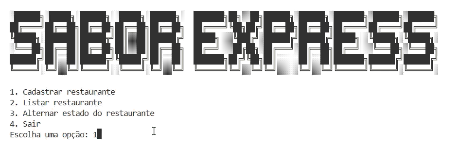

# 🍽️ Sabor Express

Aplicação de terminal desenvolvida em **Python** para cadastro e gerenciamento de restaurantes.

O projeto foi desenvolvido como parte da minha jornada de aprendizado em Python, com foco na prática de conceitos fundamentais da linguagem e na construção de uma aplicação funcional utilizando entrada de dados, estruturas de controle, funções e estruturas de dados.

---

## 🖥️ Demonstração

> 

---

## 📌 Sobre o projeto

O **Sabor Express** é uma aplicação executada diretamente pelo terminal que permite ao usuário cadastrar restaurantes, visualizar os restaurantes cadastrados e alternar o estado de ativação de cada estabelecimento.

A aplicação utiliza estruturas de dados em memória para armazenar as informações durante sua execução. Atualmente, os dados **não possuem persistência**, portanto são perdidos quando o programa é encerrado.

O projeto tem como principal objetivo consolidar conceitos fundamentais de programação em Python por meio de uma aplicação prática.

---

## 🚀 Funcionalidades

* [x] Cadastrar restaurante
* [x] Listar restaurantes cadastrados
* [x] Alternar o estado do restaurante entre ativo e inativo
* [x] Encerrar a aplicação
* [x] Validação de opções do menu
* [x] Tratamento de erros durante a entrada de dados

---

## 📋 Menu da aplicação

Ao iniciar o programa, o usuário encontra o seguinte menu:

```text
1. Cadastrar restaurante
2. Listar restaurante
3. Alternar estado do restaurante
4. Sair
```

A partir dessas opções, é possível interagir com os restaurantes cadastrados diretamente pelo terminal.

---

## 🧠 Conceitos praticados

Durante o desenvolvimento do projeto, foram aplicados diferentes conceitos fundamentais de Python:

* **Funções** — organização e reutilização das funcionalidades da aplicação
* **Laços de repetição** — controle do fluxo da aplicação e interação com o menu
* **Entrada de dados (****`input`****)** — interação com o usuário pelo terminal
* **Formatação de strings** — apresentação e organização das informações
* **Listas** — armazenamento de conjuntos de dados
* **Tuplas** — utilização de estruturas de dados imutáveis
* **Dicionários** — organização das informações dos restaurantes
* **Estruturas condicionais (****`if`****, ****`elif`****, ****`else`****)** — tomada de decisões conforme as opções selecionadas
* **Docstrings** — documentação das funções
* **Tratamento de erros (****`try`****, ****`except`****)** — prevenção e tratamento de entradas inválidas

---

## 🛠️ Tecnologias utilizadas

* **Python 3**
* **Git**
* **GitHub**

O projeto utiliza apenas recursos nativos do Python, sem dependências externas.

---

## ⚙️ Como executar

### Pré-requisitos

É necessário ter o **Python 3** instalado na máquina.

Para verificar se o Python está instalado:

```bash
python --version
```

ou:

```bash
python3 --version
```

### Clonar o repositório

```bash
git clone https://github.com/gabrieladeandradecode/py-sabor-express.git
```

Acesse a pasta do projeto:

```bash
cd py-sabor-express
```

### Executar a aplicação

No Windows:

```bash
python app.py
```

No Linux/macOS:

```bash
python3 app.py
```

> Caso o arquivo principal do projeto tenha outro nome, substitua `app.py` pelo nome correspondente.

---

## 💻 Exemplo de uso

Ao executar a aplicação, o menu será apresentado:

```text
1. Cadastrar restaurante
2. Listar restaurante
3. Alternar estado do restaurante
4. Sair

Escolha uma opção:
```

### Cadastro de restaurante

O usuário pode selecionar a opção de cadastro e informar os dados solicitados pela aplicação.

Exemplo:

```text
Escolha uma opção: 1

Nome do restaurante: Sabor da Casa
Categoria: Brasileira

Restaurante cadastrado com sucesso!
```

### Listagem

Os restaurantes cadastrados podem ser consultados através da opção de listagem:

```text
Escolha uma opção: 2

Restaurantes cadastrados:

Sabor da Casa | Brasileira | Ativo
```

### Alteração de estado

A aplicação também permite alternar o estado de um restaurante:

```text
Escolha uma opção: 3

Restaurante selecionado: Sabor da Casa

Estado alterado com sucesso!
```

---

## 📂 Estrutura do projeto

```text
sabor-express/
│
├── app.py
├── README.md
└── ...
```

> A estrutura acima é um exemplo. Caso seu projeto tenha outros arquivos ou pastas, a árvore pode ser atualizada para refletir a estrutura real do repositório.

---

## 📚 Contexto do projeto

Este projeto foi desenvolvido durante meus estudos de **Python**, como parte de uma formação da **Alura**, com o objetivo de colocar em prática conceitos fundamentais da linguagem através da construção de uma aplicação de terminal.

Mais do que apenas executar exercícios isolados, o projeto busca aplicar os conceitos estudados em uma aplicação com fluxo de interação, organização de funções e manipulação de dados.

---

## 🔮 Próximos passos

Algumas possibilidades de evolução para o projeto:

* [ ] Implementar persistência dos dados
* [ ] Armazenar restaurantes em arquivos
* [ ] Integrar um banco de dados
* [ ] Adicionar validações mais completas para os dados
* [ ] Melhorar o tratamento de erros
* [ ] Criar testes automatizados
* [ ] Desenvolver uma interface gráfica ou aplicação web
* [ ] Criar uma API para gerenciamento dos restaurantes

Essas melhorias permitiriam evoluir a aplicação de um projeto de estudos em Python para uma aplicação com maior complexidade e recursos.

---

## 👨‍💻 Autor

**Gabriela de Andrade**


---

## 📄 Licença

Este projeto foi desenvolvido para fins de estudo e prática de lógica de programação em Python.
